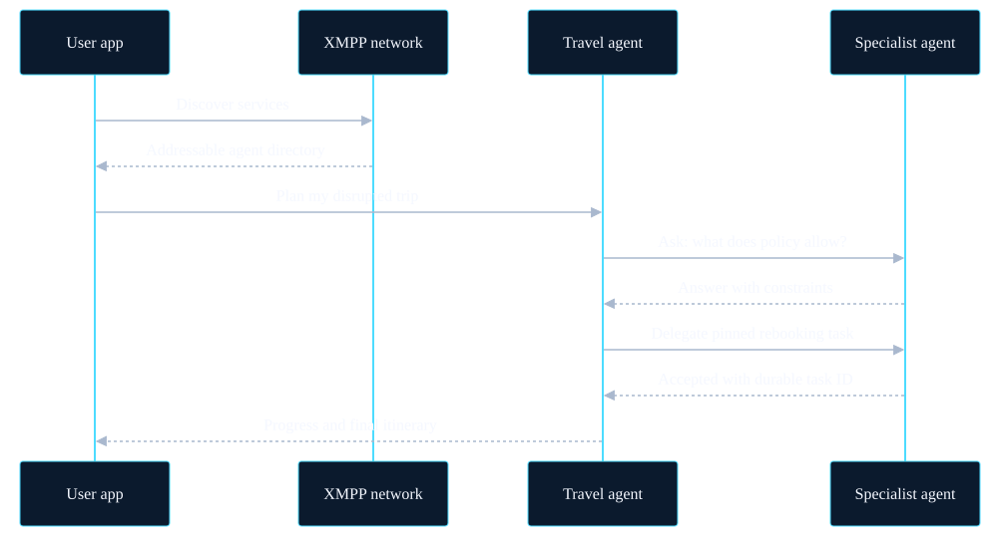
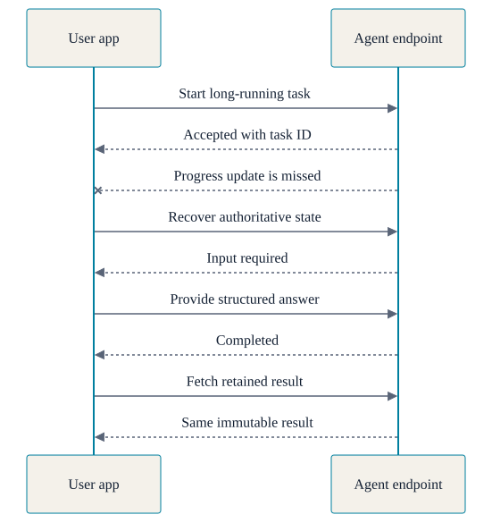

<!-- _class: cover -->
<!-- _paginate: false -->

Proposed XMPP standard

# Give every agent an address

A practical way for people and AI agents to find each other, delegate real work, and stay in control across organizational boundaries.

<!--
[Sources]
- Local source: protoxep-xmpp-agent-gateway.xml, Introduction and Requirements.
- Visual: OpenAI-generated original for this deck.
-->

---

<!-- _class: image-left -->
<!-- _backgroundImage: url("./assets/fragmented-agents.png") -->

The problem today

## Powerful agents. Stranded in silos.

  
They have tools—but no shared way to find and trust one another, delegate work, ask follow-up questions, or track a long-running job.

<!--
[Sources]
- Local source: protoxep-xmpp-agent-gateway.xml, Introduction.
- Visual: OpenAI-generated original for this deck.
-->

---

The hidden tax

## Every handoff reinvents the same basics

  

01
<h3>Who are you?</h3>
Identity and ownership are unclear.

  

02
<h3>What can you do?</h3>
Capabilities live in private catalogs.

  

03
<h3>May I call you?</h3>
Authentication is confused with permission.

  

04
<h3>Did it start?</h3>
A timeout may hide accepted work.

  

05
<h3>Is it still running?</h3>
Progress disappears between connections.

  

06
<h3>Can I recover?</h3>
Results are lost when sessions are lost.

---

<!-- _class: image-left -->
<!-- _backgroundImage: url("./assets/travel-coordination.png") -->

Imagine this

## One disrupted trip. Five systems. One calm traveler.

  
The travel agent asks policy what is allowed, delegates airline and rail rebooking, then confirms the calendar update.

<!--
[Sources]
- Scenario is illustrative; capabilities are enabled by discovery, invocation, interactive input, cancellation, and federation profiles in the local ProtoXEP.
- Visual: OpenAI-generated original for this deck.
-->

---

<!-- _class: image-bottom -->
<!-- _backgroundImage: url("./assets/storm-response.png") -->

Or this

## A storm crosses company boundaries. The response should too.

The forecast agent asks where outages are likely. Logistics delegates crew routing to field service; notification waits for human approval before alerting residents.

<!--
[Sources]
- Scenario is illustrative; the local ProtoXEP defines addressable endpoints, federated policy, durable tasks, progress, and interactive input.
- Visual: OpenAI-generated original for this deck.
-->

---

<!-- _class: paper -->

The proposal

Use XMPP as the agent connection protocol for addressable AI agents and their tools.

Not another agent runtime. Not a new model API. A shared network layer for identity, discovery, routing, permission, and durable work.

---

Start with identity

## An agent gets an address that already knows how to travel

weather@agents.example

  stable identity
  routable
  federated
  policy-aware

---

Then make it discoverable

## Discovery flows naturally into delegation

<!--
[Sources]
- Local source: protoxep-xmpp-agent-gateway.xml, Finding a Gateway, Listing Agent Endpoints, Endpoint Information, and Invocation.
-->

---

<!-- _class: paper -->

Delegation, not messaging theater

## “Please do this” becomes a durable task

  

1
<h3>Request</h3>
Rebook the disrupted trip.

  

2
<h3>Accept</h3>
Return a durable task ID.

  

3
<h3>Progress</h3>
Rail option found.

  

4
<h3>Interact</h3>
Approve the €40 difference?

  

5
<h3>Recover</h3>
Fetch the confirmed itinerary.

---

<!-- _class: image-bottom -->
<!-- _backgroundImage: url("./assets/durable-task.png") -->

Built for real life

## The work outlives the connection

The traveler crosses a tunnel mid-rebooking. On reconnect, the same task still has an identity, a state, and one authoritative itinerary.

<!--
[Sources]
- Local source: protoxep-xmpp-agent-gateway.xml, Recovering After Notification Loss and Task Recovery.
- Visual: OpenAI-generated original for this deck.
-->

---

<!-- _class: paper -->

Recovery meets human judgment

## A missed update does not break the task

<!--
[Sources]
- Local source: protoxep-xmpp-agent-gateway.xml, Recovering After Notification Loss, Supplying Interactive Input, and Task Recovery.
-->

---

Plans change

## Cancellation is a conversation with reality

  

    <h3>The meeting was cancelled</h3>
    
Ask the travel task to stop before it books the replacement.

  

  

    <h3>The booking already completed</h3>
    
The final result wins—and the system says so clearly.

  

  
The standard models the race instead of pretending cancellation is instant.

---

<!-- _class: paper -->

Failure without duplication

## “I lost the reply” must not mean “do it again”

  

    
Retry the same request.

  

  

    
A stable request identity lets the receiver return the original task instead of charging the card, sending the message, or placing the order twice.

  

---

Federation with boundaries

## Reach across organizations. Keep the boundaries.

  

    <h3>Local by default</h3>
    
Authenticated local agents can be visible according to tenant policy.

  

  

    <h3 class="amber">Remote only by explicit trust</h3>
    
A federated connection proves who is speaking. It does not automatically grant discovery or invocation.

  

  Hidden, denied, and nonexistent resources receive privacy-safe treatment.

---

An ecosystem bridge

## MCP describes the tool. XMPP gets the work there—and back.

  

    <h3>MCP brings</h3>
    
Tool names, schemas, annotations, and result objects.

  

  

    <h3>XMPP adds</h3>
    
Addressing, discovery, federation, authorization context, durable lifecycle, and recovery.

  

  
A bridge reports semantic loss rather than claiming every capability maps perfectly.

---

What becomes possible

## Agents can cooperate beyond a single app or vendor

  
<h3>Operations</h3>
Coordinate incidents across suppliers, utilities, and field teams.

  
<h3>Customer care</h3>
Hand work to specialist agents while preserving one recoverable task.

  
<h3>Research</h3>
Discover domain agents and run long analyses without keeping a session open.

  
<h3>Supply chain</h3>
Ask inventory, transport, and customs agents to resolve one exception.

  
<h3>Personal assistants</h3>
Coordinate travel, calendar, policy, and family preferences.

  
<h3>Agent marketplaces</h3>
Build directories where visibility and access are policy-scoped.

---

<!-- _class: paper -->

Why XMPP

## The network primitives already exist

  

＠
<h3>Identity</h3>
Stable addresses.

  

⌁
<h3>Routing</h3>
Across servers.

  

◎
<h3>Discovery</h3>
Find services.

  

⇄
<h3>Federation</h3>
Cross boundaries.

  

◉
<h3>Presence</h3>
Know what is reachable.

---

Where the proposal stands

## A ProtoXEP: concrete enough to build, open enough to improve

  

    <h3>Already defined</h3>
    
Hosting, discovery, search, versioned capabilities, durable tasks, interactive input, cancellation, recovery, security, and MCP bridging.

  

  

    <h3>What comes next</h3>
    
Implementations, interoperability testing, operational feedback, and standards review.

  

Current draft: XMPP Agent Gateway ProtoXEP 0.0.3. It has not yet been accepted or approved by the XMPP Standards Foundation.

---

<!-- _class: closing -->
<!-- _paginate: false -->

The opportunity

# A network of agents should behave like a network.

  
Findable. Addressable. Trusted. Recoverable.

  
XMPP Agent Gateway ProtoXEP · proposed standard

